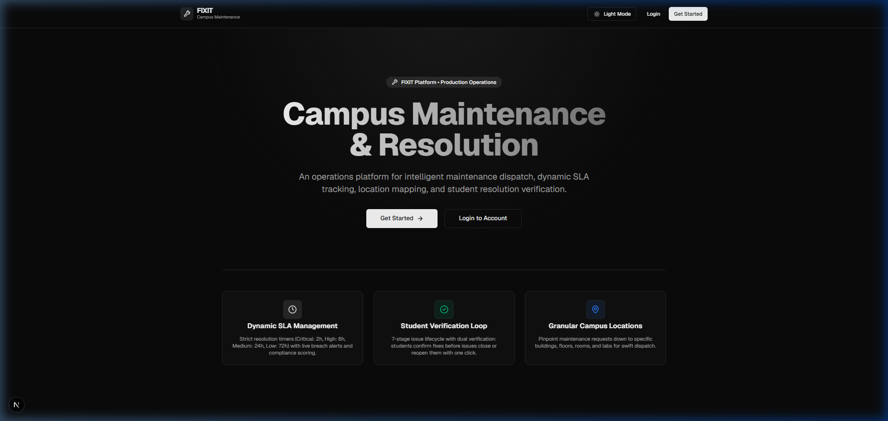
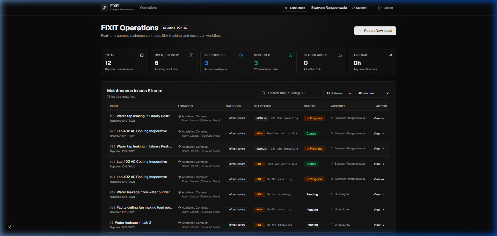
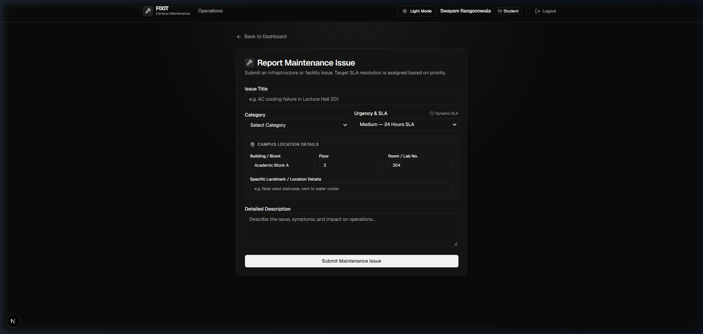
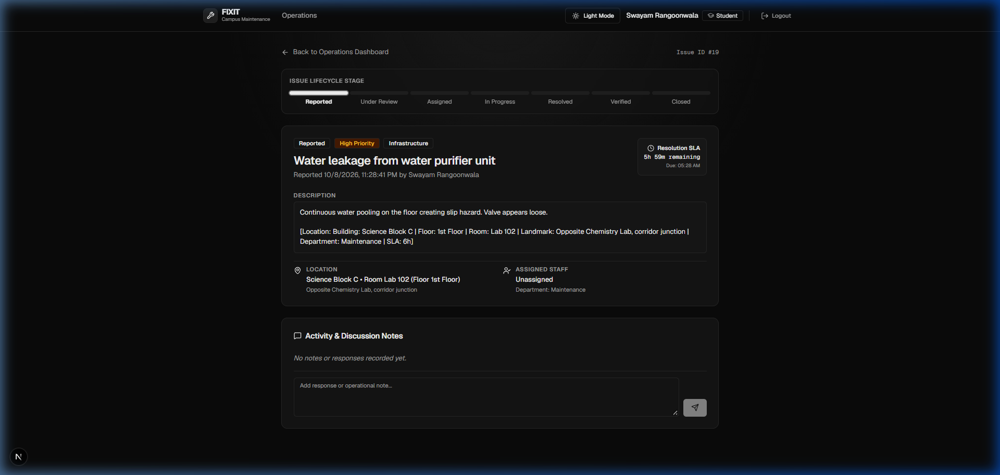
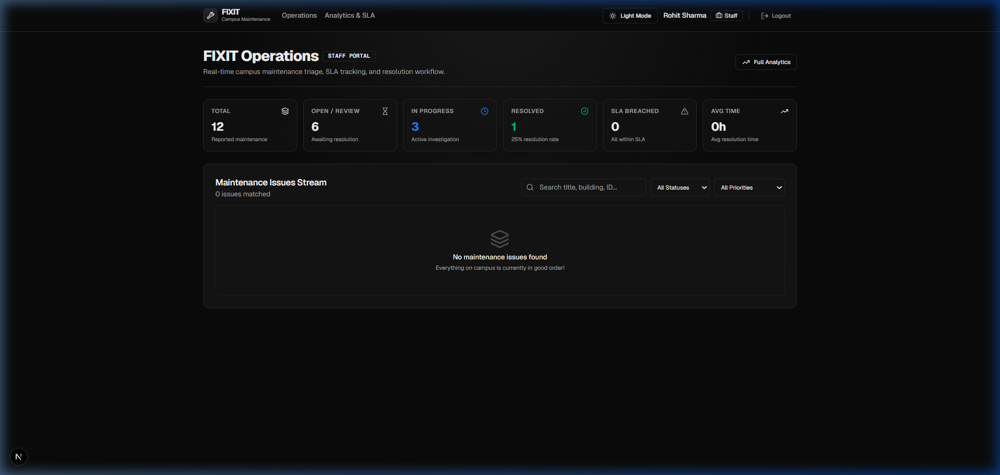

# FIXIT — Campus Maintenance & Issue Resolution Platform

> **A production-ready full-stack operations platform for university infrastructure management, dynamic SLA compliance, and cross-functional maintenance workflows.**

[](https://nodejs.org/)
[](https://nextjs.org/)
[](https://expressjs.com/)
[](https://supabase.com/)
[](LICENSE)

---

## Project Overview

**FIXIT is a full-stack campus maintenance and issue resolution platform that enables students to report infrastructure problems, administrators to triage and assign issues, and staff to manage resolution through SLA-driven workflows.**

Built to replace chaotic, informal maintenance reporting channels (such as WhatsApp groups, handwritten logbooks, or unmonitored email threads), FIXIT implements an enterprise-grade service desk architecture tailored to higher-education campuses. It couples a modern responsive web client with a secure, role-guarded RESTful backend and a relational PostgreSQL database.

---

## Problem Statement

Campus maintenance issues are often reported through informal channels, making it difficult to track ownership, priority, response time, resolution and accountability.

In university environments, infrastructure breakdowns (e.g., laboratory power outages, broken HVAC units, plumbing failures, network drops) often suffer from:
- **No Ownership Traceability**: Complaints submitted through loose forms or chats lack assigned personnel or accountability.
- **Undefined Priority & Deadlines**: Urgent safety hazards compete blindly against minor aesthetic repairs without triage.
- **Zero SLA Accountability**: Lack of target deadlines causes tickets to linger indefinitely with no escalation or visibility.
- **Absent Feedback Loop**: Students are rarely informed when repairs are finished and cannot verify whether work was completed satisfactorily.
- **No Operations Analytics**: Campus administrators lack quantitative data on recurring building defects, department workload, or vendor response rates.

---

## Solution

FIXIT solves this through structured issue reporting, categorization, priority, location tracking, staff assignment, SLA tracking, lifecycle management, verification, feedback, audit history, and operations analytics.

By establishing strict role-based operational boundaries, automated priority-based SLA calculation, and an auditable state machine, FIXIT ensures every maintenance event is tracked from first report to student-verified closure.

---

## Key Features

| Feature | Description |
| :--- | :--- |
| **Issue Reporting** | Students submit maintenance issues with granular campus locations (building, floor, room) and priority levels |
| **RBAC** | Student, Staff, and Admin access control enforced at the backend API layer |
| **Assignment** | Admin assigns issues to staff members and departments with full assignment history |
| **SLA Engine** | Priority-based resolution deadlines calculated dynamically from issue submission |
| **Lifecycle** | Controlled issue state transitions enforced via an immutable finite-state machine |
| **Audit Trail** | Chronological activity history capturing assignments, status changes, and staff resolution notes |
| **Analytics** | Operations KPIs, breach alerts, category distributions, and staff workload breakdowns |
| **Search & Filtering** | Server-side multi-parameter filtering (status, priority, building, room) and pagination |
| **Verification** | Students verify completed work before tickets are formally closed |
| **Reopening** | Students can reopen unresolved issues back to active progress with single-click escalation |

---

## User Roles

FIXIT enforces strict Role-Based Access Control (RBAC) across three distinct organizational personas:

### 🎓 STUDENT
- Create new maintenance issues with title, category, priority, building, floor, room, and description.
- View own submitted issues and live progress updates.
- Track remaining SLA countdown timers and target deadlines.
- View transparent chronological activity history.
- Verify whether completed work resolves the problem (`VERIFIED`).
- Reopen unresolved issues with explanation (`IN_PROGRESS`).
- Submit satisfaction ratings and post-resolution feedback.

### 🛠️ STAFF
- Access a dedicated **"My Assigned Issues"** queue.
- View granular location markers and student issue details.
- Transition assigned ticket states from `ASSIGNED` to `IN_PROGRESS`.
- Add operational commentary and resolution documentation.
- Mark issues as `RESOLVED` with mandatory resolution notes.

### 🛡️ ADMIN
- Full visibility across all campus maintenance issues.
- Triage newly reported issues and reject invalid/duplicate requests.
- Assign maintenance tickets to appropriate departments and technician staff.
- Manage staff accounts and department allocations.
- Access the real-time **Operations Dashboard** with live KPIs and SLA compliance scoring.
- Perform final ticket closure (`CLOSED`) following student verification.

---

## Issue Lifecycle

FIXIT models ticket progression through a canonical, backend-validated state machine:

```
REPORTED
   ↓
UNDER_REVIEW
   ↓
ASSIGNED
   ↓
IN_PROGRESS
   ↓
RESOLVED
   ↓
VERIFIED
   ↓
CLOSED
```

### Alternative & Exception Paths:
- **Rejection**: `REPORTED` / `UNDER_REVIEW` $\rightarrow$ `REJECTED` (requires admin justification reason).
- **Reopening**: `RESOLVED` $\rightarrow$ `IN_PROGRESS` (triggered when a student marks resolution as incomplete).

> **Architectural Guard**: Transitions are validated on the backend in `backend/src/utils/lifecycle.js`. Illegal jumps (e.g., attempting to transition directly from `REPORTED` to `CLOSED`) are rejected with `HTTP 400 Bad Request`.

---

## Dynamic SLA Engine

Service Level Agreements (SLAs) are enforced based on issue urgency:

| Priority | SLA Target | Target Scope |
| :--- | :--- | :--- |
| **Critical** | **2 Hours** | Safety hazards, electrical fires, gas leaks, main line water bursts |
| **High** | **6 Hours** | Server room cooling failures, classroom AV outages, lab circuit trips |
| **Medium** | **24 Hours** | Plumbing leaks, air conditioning faults, door lock failures |
| **Low** | **72 Hours** | Aesthetic paint touch-ups, furniture adjustments, lightbulb replacements |

### SLA Execution Rules:
- **Clock Start**: SLA countdown starts immediately upon ticket creation (`date_filed`).
- **Target Deadline**: Calculated and stored dynamically as `sla_due_date = date_filed + sla_hours`.
- **Dynamic Evaluation**: Remaining time, percentage elapsed, and breach status are evaluated dynamically on API requests without stale caching.
- **Resolution Classification**:
  - If resolved before deadline: Classified as **"Resolved within SLA"**.
  - If deadline passes before resolution: Flagged as **"SLA Breached"** with high-visibility alerts.

---

## Architecture

The system follows a clean, decoupled client-server architecture:

```
[ Browser Client ]
        │
        ▼ (HTTPS / JSON)
[ Next.js 16 / React 19 Frontend ]
        │
        ▼ (Axios REST Gateway)
[ Express.js Backend Server ]
   ├── Authentication Middleware (JWT)
   ├── Authorization Middleware (RBAC Guard)
   ├── Lifecycle State Machine
   ├── Dynamic SLA Engine
   └── Activity & Audit Logger
        │
        ▼ (Data Access Layer)
[ Supabase PostgreSQL Relational Database ]
```

For complete architectural diagrams, sequence diagrams, and entity-relationship models, see [`docs/ARCHITECTURE.md`](docs/ARCHITECTURE.md).

---

## Tech Stack

- **Frontend**: Next.js 16 (App Router), React 19, TypeScript, Tailwind CSS, Lucide React icons.
- **Backend**: Node.js, Express.js 4, JSON Web Tokens (JWT), bcryptjs.
- **Database**: PostgreSQL (hosted on Supabase) with native relational constraints and foreign keys.
- **Testing**: Node.js automated end-to-end integration test suite.
- **Tooling**: Git, Postman, npm.

---

## Database Design

The PostgreSQL database maintains data integrity through relational tables and performance indexes:

- **`student`**: Student authentication, college roll numbers, and department profiles.
- **`staff`**: Maintenance personnel, technician accounts, and administrative roles.
- **`department`**: Campus operational units (Electrical, Plumbing, HVAC, Carpentry, IT Infrastructure).
- **`category`**: Standardized maintenance classification categories.
- **`complaint`**: Primary issues entity with native location columns (`building`, `floor`, `room`, `location_description`), status, priority, and SLA target columns.
- **`activity_log`**: Chronological audit trail recording actor, event type, and details.
- **`assignment_history`**: Tracking technician assignments and reassignments.
- **`response`**: Operational notes and staff updates.
- **`feedback`**: Student satisfaction ratings and post-resolution remarks.

Migration script: [`backend/database/migration_phase1_canonical.sql`](backend/database/migration_phase1_canonical.sql).

---

## API Overview

All API endpoints are prefixed with `/api` and return standardized JSON responses:

| Method | Endpoint | Access Role | Description |
| :--- | :--- | :--- | :--- |
| `GET` | `/api/complaints` | Authenticated | Search, filter (status, priority, building, room), and paginate issues |
| `POST` | `/api/complaints` | Student | Submit new maintenance complaint with location and dynamic SLA |
| `GET` | `/api/complaints/:id` | Owner / Staff / Admin | Fetch issue details, SLA countdown, and full activity history |
| `PUT` | `/api/complaints/:id/status` | Staff / Admin | Validate and advance lifecycle status |
| `PUT` | `/api/complaints/:id/assign` | Admin | Assign department and technician staff |
| `POST` | `/api/complaints/:id/verify` | Owner Student | Verify completed fix or reopen back to IN_PROGRESS |
| `GET` | `/api/complaints/:id/activity` | Authenticated | Retrieve chronological audit trail for ticket |
| `GET` | `/api/staff/me/assigned` | Staff | Fetch technician's assigned queue with SLA tracking |
| `GET` | `/api/reports/operations-dashboard` | Staff / Admin | Fetch live KPIs, breach rates, and workload analytics |

---

## Security & RBAC

- **Backend-Enforced Authorization**: All access controls are evaluated on the server side in `backend/src/middleware/auth.js`. Frontend button hiding is strictly aesthetic and cannot be bypassed.
- **Ownership Verification**: Students cannot inspect or modify tickets submitted by peers (`403 Forbidden`).
- **Cryptographic Hashing**: User passwords hashed using industry-standard `bcryptjs` salts.
- **Secret Isolation**: `SUPABASE_SERVICE_ROLE_KEY` and `JWT_SECRET` are strictly kept server-side and are never bundled into client-facing JavaScript.

---

## Testing

FIXIT includes an automated end-to-end integration test runner ([`backend/scripts/run_all_tests.js`](backend/scripts/run_all_tests.js)) that verifies complete end-to-end business workflows against live database transactions:

```bash
cd backend
node scripts/run_all_tests.js
```

### Verified Test Scenarios (10/10 Passed):
- ✅ **Test 1**: Student creates issue $\rightarrow$ status `REPORTED` $\rightarrow$ appears in Admin dashboard.
- ✅ **Test 2**: Admin reviews issue $\rightarrow$ assigns staff member $\rightarrow$ transitions to `ASSIGNED`.
- ✅ **Test 3**: Staff views assigned issue $\rightarrow$ moves to `IN_PROGRESS` $\rightarrow$ adds operational note.
- ✅ **Test 4**: Staff resolves issue $\rightarrow$ transitions to `RESOLVED` with resolution notes.
- ✅ **Test 5**: Student confirms fix $\rightarrow$ transitions to `VERIFIED`.
- ✅ **Test 6**: Admin closes verified issue $\rightarrow$ transitions to `CLOSED`.
- ✅ **Test 7**: Student rejection workflow $\rightarrow$ issue reopens from `RESOLVED` back to `IN_PROGRESS`.
- ✅ **Test 8**: Dynamic SLA Engine validation $\rightarrow$ calculates correct deadline, hours, and breach state.
- ✅ **Test 9**: Horizontal privilege escalation check $\rightarrow$ student blocked from peer ticket (`403 Forbidden`).
- ✅ **Test 10**: Vertical privilege escalation check $\rightarrow$ student blocked from Admin operations (`403 Forbidden`).

---

## Project Structure

```
FIXIT/
├── .env.example                     # Root environment configuration reference
├── .gitignore                        # Global ignore rules (secrets, build outputs, node_modules)
├── README.md                         # Project documentation
├── backend/
│   ├── .env.example                  # Backend secrets template
│   ├── package.json
│   ├── database/
│   │   ├── migration_phase1_canonical.sql  # Production DDL migration script
│   │   └── supabase_schema.sql             # Relational reference schema
│   ├── scripts/
│   │   ├── migrate_records.js        # Data migration and cleanup script
│   │   └── run_all_tests.js          # Automated end-to-end verification suite
│   └── src/
│       ├── server.js                 # Express application entrypoint
│       ├── config/                   # Database connection and environment loaders
│       ├── controllers/              # Domain business logic controllers
│       ├── middleware/               # Authentication and RBAC guards
│       ├── routes/                   # REST API route handlers
│       └── utils/                    # State machine, SLA engine, and audit loggers
├── frontend/
│   ├── .env.example                  # Frontend environment template
│   ├── package.json
│   ├── tsconfig.json
│   ├── app/                          # Next.js App Router pages
│   │   ├── (auth)/                   # Authentication flows (login, register)
│   │   ├── complaints/               # Issue creation and detail views
│   │   ├── dashboard/                # Role-specific operational dashboards
│   │   ├── reports/                  # Operations analytics and SLA reporting
│   │   ├── layout.tsx                # Root layout with theme and auth providers
│   │   └── page.tsx                  # Public landing portal
│   ├── components/                   # Reusable UI components & design system
│   ├── context/                      # AuthContext and ThemeContext providers
│   └── lib/                          # Axios API client, theme tokens, and helpers
└── docs/
    ├── ARCHITECTURE.md               # In-depth architectural specifications and diagrams
    └── screenshots/                  # Verified application interface captures
        ├── landing_page.png
        ├── student_dashboard.png
        ├── issue_creation.png
        ├── issue_details.png
        └── operations_dashboard.png
```

---

## Local Development Setup

### 1. Prerequisites
- **Node.js** v18.x or later
- **npm** v9.x or later
- A free **Supabase** project (PostgreSQL)

### 2. Clone the Repository
```bash
git clone https://github.com/Swayam17o5/campus_desk2.0.git
cd campus_desk2.0
```

### 3. Backend Setup
```bash
cd backend
npm install
cp .env.example .env
```
Edit `backend/.env` with your Supabase credentials and JWT secret:
```ini
NODE_ENV=development
PORT=4000
SUPABASE_URL=https://your-project-id.supabase.co
SUPABASE_ANON_KEY=your_supabase_anon_key_here
SUPABASE_SERVICE_ROLE_KEY=your_supabase_service_role_key_here
JWT_SECRET=your_jwt_secret_key_change_in_production
JWT_EXPIRES_IN=2h
```

### 4. Database Schema Setup
Execute the DDL migration script located at [`backend/database/migration_phase1_canonical.sql`](backend/database/migration_phase1_canonical.sql) in your Supabase SQL Editor.

### 5. Frontend Setup
```bash
cd ../frontend
npm install
cp .env.example .env.local
```
Ensure `frontend/.env.local` contains:
```ini
NEXT_PUBLIC_API_URL=http://localhost:4000/api
```

---

## Running the Application

### Start the Backend Server
```bash
cd backend
npm run dev
```
Backend API will start at: **`http://localhost:4000`**

### Start the Frontend Client
```bash
cd frontend
npm run dev
```
Frontend application will start at: **`http://localhost:3000`**

---

## Screenshots

| View | Preview |
| :--- | :--- |
| **Landing Portal** |  |
| **Student Dashboard** |  |
| **Issue Submission** |  |
| **Issue Details & SLA** |  |
| **Operations Analytics** |  |

---

## Deployment

- **Frontend**: Deployment-ready for **Vercel** (`npm run build` passes with zero errors).
- **Backend**: Deployment-ready for containerized Node.js environments (**Render**, **Railway**, **AWS ECS**).
- **Database**: Hosted and managed on **Supabase PostgreSQL**.

> *Status: Deployment-ready; production deployment configuration is pending.*

---

## Future Improvements

- **Real-Time Push Notifications**: Integrating WebSockets or Supabase Realtime for instant status updates.
- **Automated Escalation Triggers**: Scheduled cron workers to alert department heads when an issue breaches 80% SLA elapsed time.
- **Native Image Uploads**: Direct S3/Supabase Storage bucket integration for photo attachment proof.
- **Technician Mobile View**: Optimized offline-first PWA for campus field technicians.

---

## Author

**Swayam Rangoonwala**  
- GitHub: [@Swayam17o5](https://github.com/Swayam17o5)  
- Role: Associate Software Engineer  
