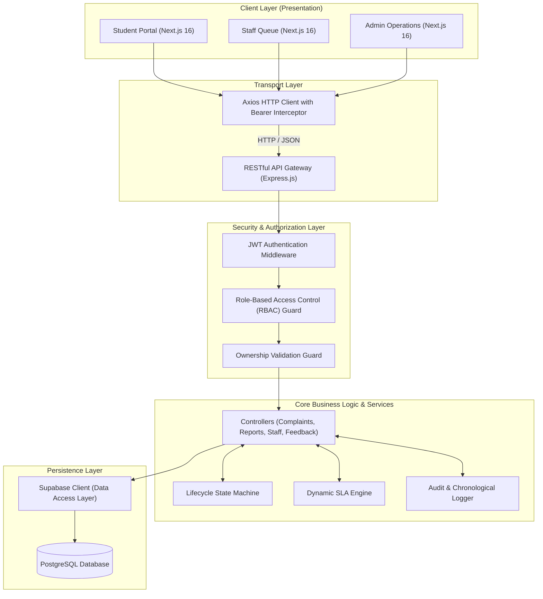
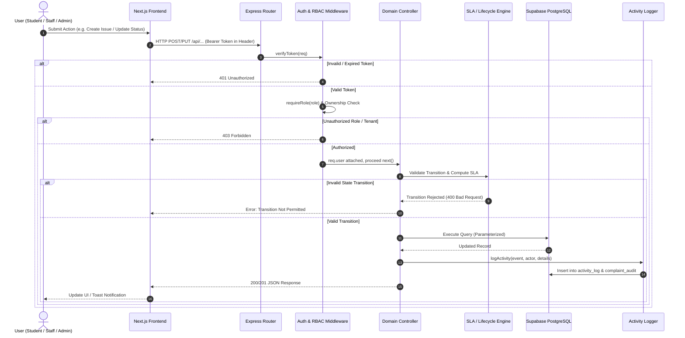
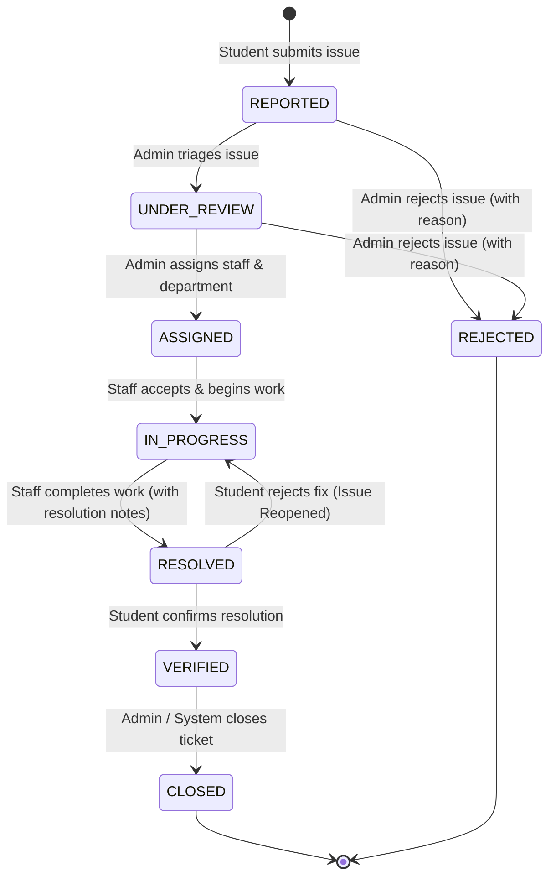
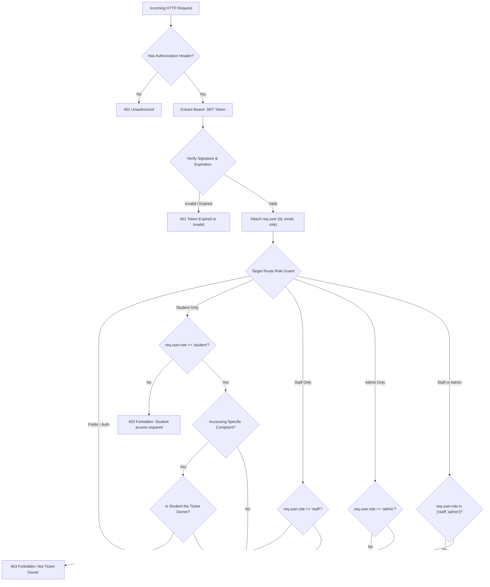
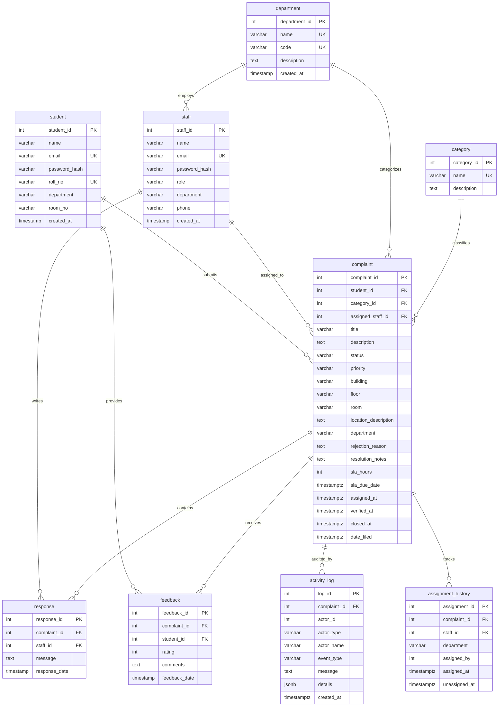

# FIXIT System Architecture & Technical Specifications

> **FIXIT — Campus Maintenance & Issue Resolution Platform**  
> Technical Architecture, State Machines, Data Models, and Security Protocols.

---

## 1. High-Level System Architecture

FIXIT is engineered as a decoupled, multi-tiered architecture with strict boundaries between presentation, business logic orchestration, and relational data persistence.



---

## 2. Request Flow Architecture

Every incoming transaction passes through security gates before invoking business logic or touching the database:



---

## 3. Canonical Issue Lifecycle State Machine

FIXIT enforces a strict, deterministic finite-state machine (FSM). Status mutations must satisfy allowed directional transitions; arbitrary status jumps are rejected at the API layer.



### Transition Matrix Enforced by Backend (`src/utils/lifecycle.js`):

| Current Status | Allowed Next Statuses | Authorized Actors |
| :--- | :--- | :--- |
| `REPORTED` | `UNDER_REVIEW`, `REJECTED` | `admin` |
| `UNDER_REVIEW` | `ASSIGNED`, `REJECTED` | `admin` |
| `ASSIGNED` | `IN_PROGRESS` | `staff` (assigned), `admin` |
| `IN_PROGRESS` | `RESOLVED` | `staff` (assigned), `admin` |
| `RESOLVED` | `VERIFIED`, `IN_PROGRESS` (reopen) | `student` (owner), `admin` |
| `VERIFIED` | `CLOSED` | `admin`, `system` |
| `REJECTED` | *(Terminal state)* | None |
| `CLOSED` | *(Terminal state)* | None |

---

## 4. Authentication & Role-Based Access Control (RBAC) Flow



---

## 5. Dynamic SLA Engine Workflow

The SLA Engine computes resolution targets dynamically relative to submission time (`date_filed`).

```mermaid
flowchart LR
    A["Issue Submission"] --> B["Capture date_filed & priority"]
    B --> C{"Priority Lookup"}
    C -->|Critical| D["sla_hours = 2h"]
    C -->|High| E["sla_hours = 6h"]
    C -->|Medium| F["sla_hours = 24h"]
    C -->|Low| G["sla_hours = 72h"]
    
    D & E & F & G --> H["sla_due_date = date_filed + sla_hours"]
    
    H --> I{"Ticket Status"}
    I -->|RESOLVED / VERIFIED / CLOSED| J["Check resolved_at vs sla_due_date"]
    J -->|resolved_at <= sla_due_date| K["Resolved within SLA"]
    J -->|resolved_at > sla_due_date| L["SLA Breached (Resolved Late)"]

    I -->|Active (REPORTED .. IN_PROGRESS)| M{"Current Time vs sla_due_date"}
    M -->|now <= sla_due_date| N["Remaining Time Countdown & % Progress"]
    M -->|now > sla_due_date| O["SLA Breached Alert"]
```

---

## 6. Database Schema & Entity Relationships

The PostgreSQL relational database is structured to maintain referential integrity with cascading foreign keys and audit preservation.



---

## 7. Verified REST API Specifications

All endpoints are hosted at `/api` and return standardized JSON formats.

### Complaints Resource

| Method | Endpoint | Required Role | Request Body / Query Params | Expected Behavior |
| :--- | :--- | :--- | :--- | :--- |
| `GET` | `/api/complaints` | Authenticated | `?search=&status=&priority=&category=&building=&room=&page=&limit=` | Returns paginated list. Students only receive their own issues; Admin/Staff receive all issues. |
| `POST` | `/api/complaints` | `student` | `{ title, description, category_id, priority, building, floor, room, location_description }` | Creates issue with status `REPORTED`, calculates dynamic SLA, records audit log, returns `201 Created`. |
| `GET` | `/api/complaints/:id` | Authenticated | URL parameter `:id` | Returns issue details, dynamic SLA evaluation, and activity timeline. Blocks non-owner students with `403`. |
| `PUT` | `/api/complaints/:id/status` | Staff or Admin | `{ status, notes, rejection_reason }` | Validates transition through lifecycle state machine. Enforces staff ownership. |
| `PUT` | `/api/complaints/:id/assign` | `admin` | `{ staff_id, department }` | Transitions status from `UNDER_REVIEW` to `ASSIGNED`, updates `assigned_at`, logs event. |
| `POST` | `/api/complaints/:id/verify` | Owner `student` | `{ verified: true/false, notes }` | Transitions `RESOLVED` to `VERIFIED` (if confirmed) or reopens to `IN_PROGRESS` (if rejected). |
| `GET` | `/api/complaints/:id/activity` | Authenticated | URL parameter `:id` | Returns chronological array of all historical actions, comments, and status mutations. |

### Staff Operations Resource

| Method | Endpoint | Required Role | Request Body / Query Params | Expected Behavior |
| :--- | :--- | :--- | :--- | :--- |
| `GET` | `/api/staff/me/assigned` | `staff` | None (reads token) | Returns tickets assigned to current staff user with dynamic SLA timers and location details. |
| `GET` | `/api/staff/:id/complaints` | Assigned Staff or Admin | URL parameter `:id` | Returns tickets assigned to specified staff member. |

### Analytics & Reporting Resource

| Method | Endpoint | Required Role | Request Body / Query Params | Expected Behavior |
| :--- | :--- | :--- | :--- | :--- |
| `GET` | `/api/reports/operations-dashboard` | Staff or Admin | None | Computes live operational KPIs, SLA compliance %, breach count, status and location breakdowns. |

---

## 8. Security Design & Threat Mitigation

1. **Defense in Depth**: Access control is enforced at the backend routing level (`backend/src/middleware/auth.js`) independently of frontend UI controls.
2. **Horizontal Privilege Escalation Prevention**: When a student queries an issue by ID (`GET /api/complaints/:id`), the controller validates that `complaint.student_id === req.user.id`. Requests for other students' tickets are rejected with `403 Forbidden`.
3. **Secret Isolation**:
   - `SUPABASE_SERVICE_ROLE_KEY` is exclusively consumed by Node.js backend controllers and never bundled into frontend assets.
   - Frontend communicates exclusively with the Express REST API via public `NEXT_PUBLIC_API_URL`.
4. **Input Sanitization**: Database operations use parameterized queries through the Supabase client SDK, preventing SQL injection vulnerabilities.
